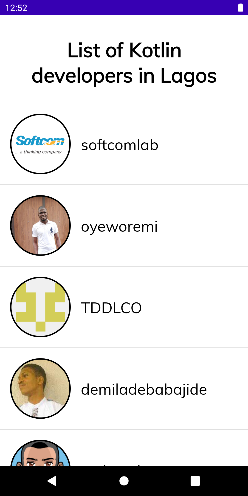
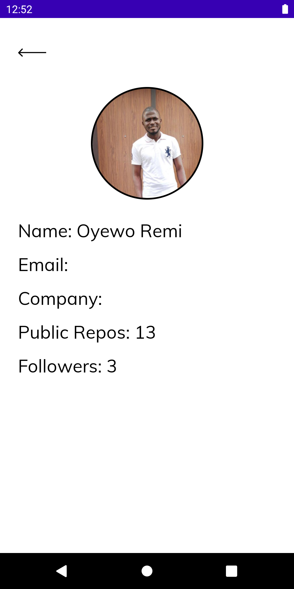
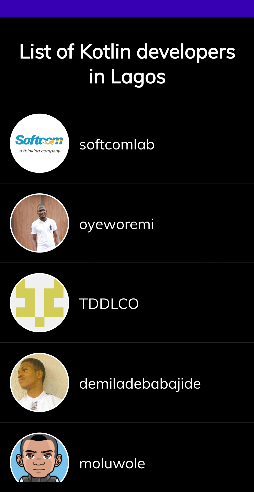
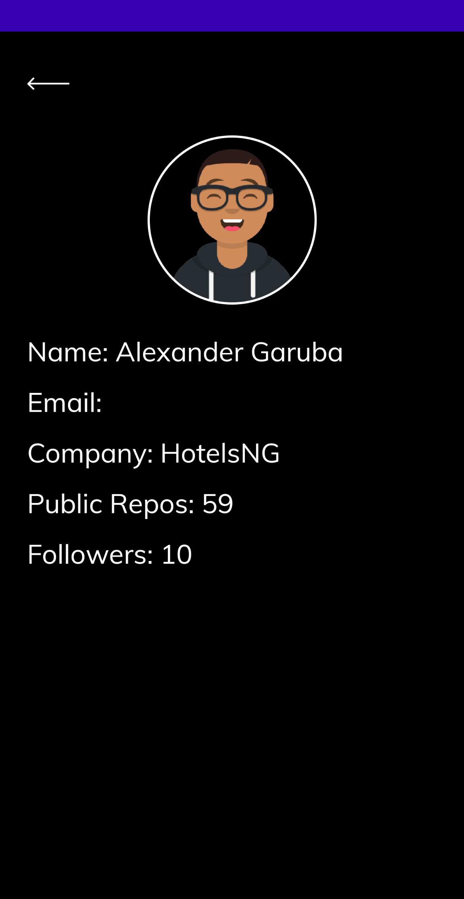

# List Of Kotlin Developers in Lagos App
This app shows a brief list of developers on github with kotlin projects and based in Lagos using
the github api.

Contains:
- MVVM architecture
- Dependency injection with dagger
- Clean architecture
- DiffUtil to update recyclerview
- Coroutines for multithreading
- Retrofit for network calls
- Glide to display images
- Room for data persistence
- Mappers for mapping different entities to/from api models
- Android viewBinding library
- Unit test for mappers
- ViewModel test
- Room coroutine test
- Customised dark mode UI

  
  
  
  

